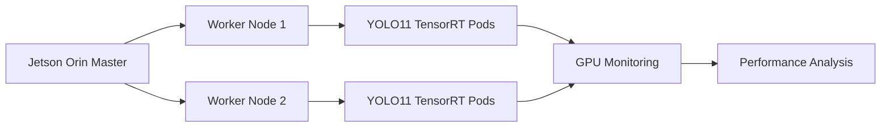
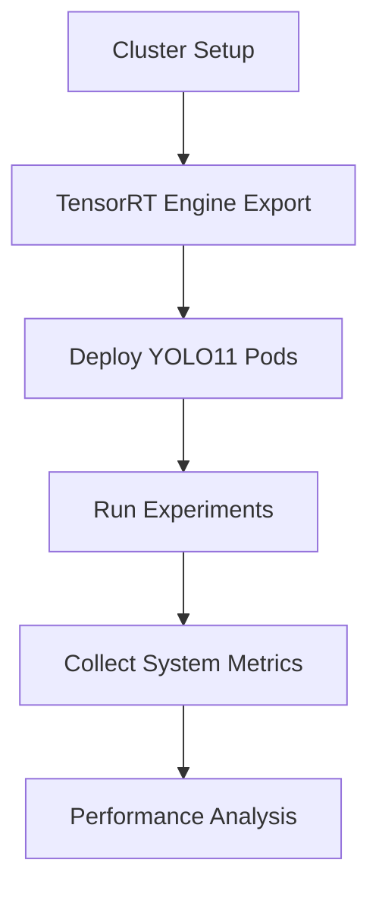

# GPUplacement

A Kubernetes-based GPU scheduling framework for deploying and evaluating TensorRT-optimized YOLO11 workloads on an NVIDIA Jetson Orin cluster.

---

## Overview

GPUplacement is an experimental framework designed to evaluate GPU scheduling strategies for edge AI workloads running on Kubernetes.

The project demonstrates how multiple YOLO11 TensorRT inference workloads can be deployed across a Jetson Orin cluster while monitoring hardware utilization and scheduling behavior.

The repository includes:

* Kubernetes cluster setup
* TensorRT engine generation
* YOLO11 deployment
* GPU resource monitoring
* Experimental methodology for scheduling evaluation

---

## System Architecture



---

## Key Features

* Kubernetes v1.29 cluster deployment
* Containerd runtime configuration
* NVIDIA Container Runtime integration
* TensorRT-optimized YOLO11 inference
* Multi-workload deployment
* GPU resource monitoring using tegrastats
* Automatic workload scheduling experiments
* Performance evaluation on NVIDIA Jetson Orin

---

## Project Workflow



---

## Repository Structure

```text
GPUplacement/

README.md

docs/
├── Setup.md
├── YOLO_Deployment.md
└── Experiments.md

scripts/

yaml/

results/

images/
```

---

## Documentation

| Document           | Description                                     |
| ------------------ | ----------------------------------------------- |
| Setup.md           | Kubernetes and Containerd installation          |
| YOLO_Deployment.md | TensorRT engine generation and deployment       |
| Experiments.md     | Experimental methodology and evaluation process |

---

## Quick Start

1. Build the Kubernetes cluster by following **Setup.md**
2. Export YOLO11 models to TensorRT engines.
3. Deploy inference Pods using **YOLO_Deployment.md**
4. Execute the experimental workflow described in **Experiments.md**
5. Analyze the collected performance metrics.

---

## Technologies

* Ubuntu 24.04
* Kubernetes v1.29
* Containerd
* NVIDIA Container Runtime
* TensorRT
* CUDA
* YOLO11
* NVIDIA Jetson Orin

---

## Future Work

Future work will focus on hardware-aware GPU scheduling strategies for edge AI workloads.

Potential improvements include:

* Hardware-aware scheduling algorithms
* Dynamic workload allocation
* Latency-aware scheduling
* Energy-efficient GPU scheduling

---

## License

This repository is intended for academic research and educational purposes.
