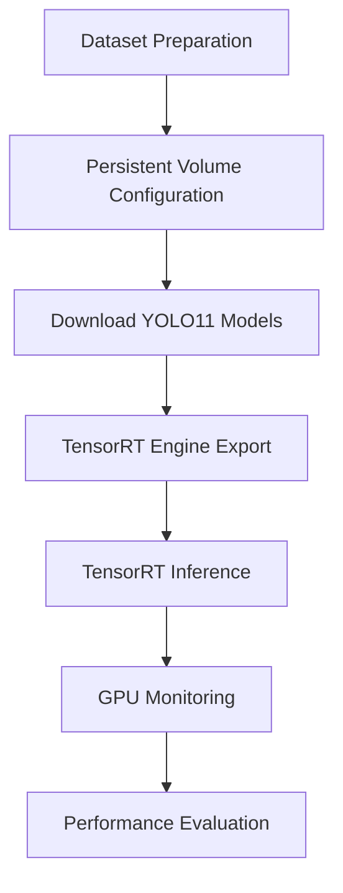

# YOLO11 Deployment on Kubernetes

This document describes the deployment of YOLO11 models on a Kubernetes cluster running on NVIDIA Jetson Orin devices. The deployment uses TensorRT for inference acceleration and NVIDIA MPS for GPU resource sharing.

> **Note**
>
> The project was initially developed using **YOLOv8** and later migrated to **YOLO11**. The deployment pipeline remained the same while the model files were updated to the latest version.

---

## Environment

| Component | Version |
|-----------|---------|
| OS | Ubuntu 24.04 |
| Kubernetes | v1.29 |
| Container Runtime | Containerd |
| GPU | NVIDIA Jetson Orin |
| Framework | Ultralytics YOLO11 |
| Inference Engine | TensorRT |
| GPU Runtime | NVIDIA Container Runtime |

---

## Deployment Workflow

The overall deployment workflow is illustrated below.



---

## 1. Install Ultralytics

Install the latest Ultralytics package before downloading the models.

```bash
python3 -m pip install --upgrade pip

python3 -m pip install ultralytics

python3 -m pip install --upgrade --ignore-installed ultralytics
```

Verify the installation.

```bash
python3

from ultralytics import YOLO
```

---

## 2. Prepare Dataset

Different datasets were prepared depending on the YOLO task.

| Task | Dataset |
|------|---------|
| Classification | Imagenette |
| Detection | COCO |
| Segmentation | COCO |
| Pose Estimation | COCO |
| Oriented Bounding Box | DOTA |

Example (COCO)

```bash
mkdir -p ~/yolo/data/coco_src

find val2017 \
-name "*.jpg" \
| shuf -n 100 \
| xargs -I {} cp {} ~/yolo/data/coco_src/
```

---

## 3. Configure Persistent Storage

Model files, datasets, TensorRT engines, and inference results are stored in Kubernetes Persistent Volumes.

Example directory structure.

```text
yolo/

├── data/
│   ├── classify_src/
│   ├── coco_src/
│   └── dota_src/
│
├── models/
│
├── runs/
│   └── logs/
│
└── results/
```

Example PersistentVolumeClaim.

```yaml
apiVersion: v1
kind: PersistentVolumeClaim

metadata:
  name: yolo-models-pvc

spec:
  accessModes:
    - ReadWriteMany

  resources:
    requests:
      storage: 5Gi
```

---

## 4. Download YOLO11 Models

Before exporting TensorRT engines, download the required YOLO11 models.

The following models were used.

| Model | Task |
|--------|------|
| yolo11n.pt | Detection |
| yolo11n-cls.pt | Classification |
| yolo11n-seg.pt | Segmentation |
| yolo11n-pose.pt | Pose Estimation |
| yolo11n-obb.pt | Oriented Bounding Box |

The models are automatically downloaded when they are first loaded by Ultralytics.

Example.

```python
from ultralytics import YOLO

YOLO("yolo11n.pt")

YOLO("yolo11n-cls.pt")

YOLO("yolo11n-seg.pt")

YOLO("yolo11n-pose.pt")

YOLO("yolo11n-obb.pt")
```

After downloading, verify that all model files exist.

```bash
ls models/
```

Expected output.

```text
yolo11n.pt
yolo11n-cls.pt
yolo11n-seg.pt
yolo11n-pose.pt
yolo11n-obb.pt
```

---

## 5. Export TensorRT Engine

The script exports TensorRT engines for all supported YOLO11 tasks.

To reduce deployment time, TensorRT engines are generated before inference.

If an engine file already exists, the export process is skipped automatically.

---

### Create TensorRT Export Pod

```yaml
apiVersion: v1
kind: Pod

metadata:
  name: yolo11-export

spec:
  nodeSelector:
    kubernetes.io/hostname: gpu-orin2

  restartPolicy: Never

  containers:

  - name: yolo-gpu

    image: ultralytics/ultralytics:latest-jetson-jetpack6

    securityContext:
      privileged: true

    resources:
      limits:
        nvidia.com/gpu: 1
```

Deploy the Pod.

```bash
kubectl apply -f yolo11-export.yaml
```

Verify the Pod.

```bash
kubectl get pods

kubectl logs yolo11-export
```

---

### Export TensorRT Engines

The following Python script converts all YOLO11 models into TensorRT engines.

```python
import os
from ultralytics import YOLO

model_list = [
    ("yolo11n.pt", None, 640),
    ("yolo11n-cls.pt", "classify", 640),
    ("yolo11n-seg.pt", None, 640),
    ("yolo11n-pose.pt", None, 640),
    ("yolo11n-obb.pt", None, 640),
]

for model, task, imgsz in model_list:

    engine = model.replace(".pt", ".engine")

    if os.path.exists(engine):

        print(f"[SKIP] {engine}")

        continue

    y = YOLO(model, task=task) if task else YOLO(model)

    y.export(

        format="engine",

        imgsz=imgsz,

        device=0,

        half=True

    )

print("TensorRT export completed.")
```

---

### Generated TensorRT Engines

After the export process, the following engine files should be available.

```text
models/

yolo11n.engine

yolo11n-cls.engine

yolo11n-seg.engine

yolo11n-pose.engine

yolo11n-obb.engine
```

Verify the generated engines.

```bash
ls models/*.engine
```

---

## 6. GPU Monitoring

During engine generation, GPU utilization was monitored using NVIDIA tegrastats.

Start tegrastats.

```bash
nohup tegrastats --interval 1000 \
> runs/logs/tegrastats-export.log &
```

The generated log contains

- GPU utilization
- CPU utilization
- Memory usage
- Power consumption

---

## 7. Verify TensorRT Export

Check the Pod status.

```bash
kubectl get pods
```

View export logs.

```bash
kubectl logs yolo11-export
```

Successful export logs are similar to the following.

```text
[EXPORT] yolo11n.pt

[DONE] yolo11n.engine

[EXPORT] yolo11n-cls.pt

[DONE] yolo11n-cls.engine

...

TensorRT export completed.
```

---

## Notes

The export process is executed only once.

If an engine file already exists, the deployment automatically skips the conversion step and directly reuses the existing TensorRT engine.

---

## 8. Deploy TensorRT Inference

After the TensorRT engines have been generated, deploy a Kubernetes Pod to perform inference.

The inference Pod executes `inference.py`, which loads the exported TensorRT engine and performs inference on the selected dataset.

---

### Create Inference Pod

```yaml
apiVersion: v1
kind: Pod

metadata:
  name: yolo11-inference

spec:

  restartPolicy: Never

  nodeSelector:
    kubernetes.io/hostname: gpu-orin2

  containers:

  - name: yolo

    image: ultralytics/ultralytics:latest-jetson-jetpack6

    workingDir: /workspace

    command:
      - /bin/bash
      - -c

    args:
      - |
        python3 inference.py

    resources:
      limits:
        nvidia.com/gpu: 1

    volumeMounts:

      - name: yolo-data
        mountPath: /workspace

  volumes:

  - name: yolo-data

    persistentVolumeClaim:
      claimName: yolo-models-pvc
```

Deploy the inference Pod.

```bash
kubectl apply -f yolo11-inference.yaml
```

Verify the Pod.

```bash
kubectl get pods
```

---

## 9. Run TensorRT Inference

The inference script loads the exported TensorRT engine and performs inference on the selected dataset.

Example inference script.

```python
from ultralytics import YOLO

model = YOLO("models/yolo11n.engine")

model.predict(

    source="data/coco_src",

    imgsz=640,

    device=0,

    save=True,

    project="results",

    name="detect"

)
```

Classification example.

```python
from ultralytics import YOLO

model = YOLO("models/yolo11n-cls.engine")

model.predict(

    source="data/classify_src",

    imgsz=224,

    device=0,

    save=True

)
```

Segmentation example.

```python
from ultralytics import YOLO

model = YOLO("models/yolo11n-seg.engine")

model.predict(

    source="data/coco_src",

    imgsz=640,

    device=0,

    save=True

)
```

Pose estimation example.

```python
from ultralytics import YOLO

model = YOLO("models/yolo11n-pose.engine")

model.predict(

    source="data/coco_src",

    imgsz=640,

    device=0,

    save=True

)
```

OBB example.

```python
from ultralytics import YOLO

model = YOLO("models/yolo11n-obb.engine")

model.predict(

    source="data/dota_src",

    imgsz=640,

    device=0,

    save=True

)
```

---

## 10. Monitor GPU Utilization

Monitor GPU usage during inference.

```bash
nohup tegrastats --interval 1000 \
> runs/logs/tegrastats-inference.log &
```

The generated log contains

- GPU utilization
- CPU utilization
- Memory usage
- Power consumption

---

## 11. Verify Deployment

Verify that the inference Pod is running.

```bash
kubectl get pods
```

Example.

```text
NAME                READY   STATUS

yolo11-inference    1/1     Running
```

View the inference log.

```bash
kubectl logs yolo11-inference
```

Example.

```text
image 1/100

640x640

person

car

bus

Speed:

preprocess

inference

postprocess
```

---

## 12. Verify Output

Verify that inference results are generated successfully.

```bash
ls results/
```

Example.

```text
detect/

classify/

segment/

pose/

obb/
```

Each directory contains the inference results generated by YOLO11.

---

## 13. Verify GPU Allocation

Verify that GPU resources are allocated correctly.

```bash
kubectl describe node gpu-orin2 | grep nvidia.com/gpu
```

Example.

```text
Capacity:

nvidia.com/gpu: 5

Allocatable:

nvidia.com/gpu: 5
```

This confirms that GPU resources are exposed through the NVIDIA Device Plugin and can be requested by Kubernetes Pods.

---

## 14. GPU Resource Sharing

The Kubernetes cluster uses the NVIDIA Device Plugin with Multi-Process Service (MPS) to expose multiple logical GPU resources from a single physical GPU.

The following configuration enables GPU Time-Slicing.

```yaml
version: v1

sharing:
  timeSlicing:
    mps: true

    resources:
      - name: nvidia.com/gpu
        replicas: 5
```

After applying the configuration, each Jetson Orin GPU exposes five logical GPU resources.

Verify the configuration.

```bash
kubectl describe node gpu-orin2 | grep nvidia.com/gpu
```

Example.

```text
Capacity:

nvidia.com/gpu: 5

Allocatable:

nvidia.com/gpu: 5
```

---

## 15. Multi-Pod Scheduling

Because GPU Time-Slicing is enabled, multiple inference Pods can share a single physical GPU.

Example.

```text
GPU-Orin2

├── YOLO11 Classification

├── YOLO11 Detection

├── YOLO11 Segmentation

├── YOLO11 Pose

└── YOLO11 OBB
```

Verify running Pods.

```bash
kubectl get pods -o wide
```

Example.

```text
NAME                    STATUS

yolo11-cls              Running

yolo11-detect           Running

yolo11-seg              Running

yolo11-pose             Running

yolo11-obb              Running
```

---

## 16. Performance Monitoring

GPU performance was monitored throughout deployment and inference.

Monitoring tools.

- NVIDIA tegrastats
- kubectl logs
- kubectl describe node

Example.

```bash
tegrastats --interval 1000
```

Metrics collected.

- GPU Utilization
- CPU Utilization
- Memory Usage
- Power Consumption
- TensorRT Inference Status

---

## 17. Deployment Verification

Verify that all Kubernetes components are operating correctly.

Check Nodes.

```bash
kubectl get nodes
```

Check Pods.

```bash
kubectl get pods -A
```

Check GPU resources.

```bash
kubectl describe node gpu-orin2
```

Check TensorRT engines.

```bash
ls models/*.engine
```

Check inference results.

```bash
ls results/
```

---

## Deployment Summary

The deployment successfully demonstrates the following features.

- Kubernetes-based GPU scheduling
- NVIDIA Jetson Orin cluster deployment
- Containerd runtime configuration
- NVIDIA Container Runtime integration
- NVIDIA Device Plugin deployment
- GPU Time-Slicing using NVIDIA MPS
- TensorRT engine generation
- TensorRT-accelerated YOLO11 inference
- Persistent Volume-based data management
- GPU utilization monitoring using tegrastats

---

## Project Workflow

```text
Ubuntu 24.04

↓

Containerd

↓

Kubernetes Cluster

↓

NVIDIA Runtime

↓

NVIDIA Device Plugin

↓

GPU Time-Slicing (MPS)

↓

YOLO11 Model

↓

TensorRT Engine Export

↓

TensorRT Inference

↓

GPU Scheduling

↓

Performance Monitoring
```

---

# Deployment Completed

The Kubernetes cluster successfully supports GPU-accelerated YOLO11 deployment using TensorRT and NVIDIA MPS.

This deployment provides a reproducible environment for GPU scheduling experiments, TensorRT inference optimization, and multi-workload execution on NVIDIA Jetson Orin devices.
