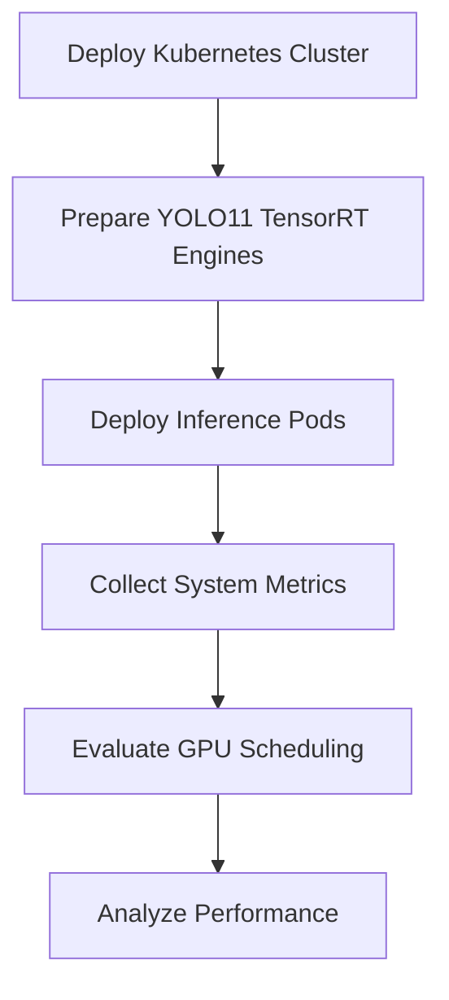

# Experiments

This document describes the experimental methodology used to evaluate GPU scheduling performance on a Kubernetes cluster built with NVIDIA Jetson Orin devices.

---

## Experimental Workflow

The overall experimental procedure is illustrated below.



---

## 1. Experimental Environment

The experiments were conducted using a Kubernetes cluster consisting of one control-plane node and two NVIDIA Jetson Orin worker nodes.

### Hardware

| Component         | Specification              |
| ----------------- | -------------------------- |
| Control Plane     | NVIDIA Jetson Orin         |
| Worker Nodes      | 2 × NVIDIA Jetson Orin     |
| GPU               | NVIDIA Jetson Orin GPU     |
| Operating System  | Ubuntu 24.04               |
| CUDA              | CUDA 12.x                  |
| TensorRT          | TensorRT                   |
| Container Runtime | Containerd                 |
| Kubernetes        | v1.29                      |

---

## 2. Workload Configuration

Five YOLO11 tasks were evaluated during the experiments.

| Task                  | Model        |
| --------------------- | ------------ |
| Object Detection      | YOLO11n      |
| Image Classification  | YOLO11n-cls  |
| Instance Segmentation | YOLO11n-seg  |
| Pose Estimation       | YOLO11n-pose |
| Oriented Bounding Box | YOLO11n-obb  |

All models were exported to TensorRT engines before deployment.

---

## 3. Dataset Configuration

Different datasets were used depending on the inference task.

| Task            | Dataset                |
| --------------- | ---------------------- |
| Detection       | COCO Validation Images |
| Classification  | ImageNet Sample Images |
| Segmentation    | COCO Validation Images |
| Pose Estimation | COCO Pose Images       |
| OBB             | DOTA Dataset           |

The datasets were stored on Persistent Volumes and shared across worker nodes.

---

## 4. Monitoring Environment

System resource utilization was monitored throughout the experiments.

Monitoring tools included:

* tegrastats
* kubectl
* NVIDIA Device Plugin
* Linux system monitoring utilities

The following metrics were collected during inference.

* GPU Utilization
* CPU Utilization
* Memory Usage
* Power Consumption
* Inference Time
* TensorRT Execution Status

---

## 5. Experimental Scenarios

The following experiments were performed.

| Experiment   | Description                      |
| ------------ | -------------------------------- |
| Experiment 1 | Sequential TensorRT Inference    |
| Experiment 2 | Parallel TensorRT Inference      |
| Experiment 3 | Automatic Kubernetes Scheduling  |
| Experiment 4 | Multi-Node Workload Distribution |

Each experiment was repeated under the same software environment to ensure consistent evaluation.
---

## 6. Experiment 1 - Sequential Inference

The first experiment evaluated the execution time and resource utilization of individual YOLO11 workloads.

Each workload was executed independently on a worker node without any concurrent inference tasks.

The objective of this experiment was to establish the baseline performance of each TensorRT engine.

### Procedure

1. Deploy a single inference Pod.
2. Execute one YOLO11 task.
3. Collect system metrics using **tegrastats**.
4. Record inference time and resource utilization.
5. Remove the Pod before starting the next workload.

Example deployment.

```bash
kubectl apply -f yolo11-detect.yaml
```

Monitor the workload.

```bash
kubectl logs yolo11-detect

tegrastats --interval 1000
```

The same procedure was repeated for

* Detection
* Classification
* Segmentation
* Pose Estimation
* Oriented Bounding Box Detection

---

## 7. Experiment 2 - Parallel Inference

The second experiment evaluated Kubernetes scheduling under multiple simultaneous inference workloads.

Instead of executing workloads sequentially, several inference Pods were deployed at the same time.

The objective was to evaluate GPU resource utilization during concurrent execution.

### Procedure

1. Deploy multiple inference Pods simultaneously.
2. Assign workloads to available worker nodes.
3. Monitor GPU utilization.
4. Record inference performance.

Example.

```bash
kubectl apply -f yolo11-detect.yaml

kubectl apply -f yolo11-cls.yaml

kubectl apply -f yolo11-seg.yaml

kubectl apply -f yolo11-pose.yaml

kubectl apply -f yolo11-obb.yaml
```

Verify Pod status.

```bash
kubectl get pods -o wide
```

---

## 8. Experiment 3 - Automatic Scheduling

The final experiment evaluated the default scheduling behavior of Kubernetes.

Unlike the previous experiments, the `nodeSelector` constraint was removed so that Kubernetes could automatically determine the worker node for each workload.

### Objective

Evaluate whether Kubernetes distributes workloads across multiple worker nodes without manual node assignment.

Deployment strategy.

```yaml
# nodeSelector removed

spec:

  containers:

  - name: yolo
```

Verify scheduling results.

```bash
kubectl get pods -o wide
```

Example.

```text
NAME                NODE

yolo11-detect       gpu-orin2

yolo11-cls          gpu-orin3

yolo11-seg          gpu-orin2

yolo11-pose         gpu-orin3

yolo11-obb          gpu-orin2
```

The scheduling results were compared with the manually assigned deployment used in the previous experiments.

---

## 9. Resource Monitoring

Resource utilization was monitored throughout every experiment.

The following tools were used to monitor system resources during each experiment.

• tegrastats
• kubectl top
• kubectl describe node
• kubectl logs

The collected metrics included

* GPU Utilization
* CPU Utilization
* Memory Usage
* Power Consumption
* Pod Status
* TensorRT Execution Time

The monitoring data were stored for later performance analysis.

---

## 10. Performance Metrics

The following performance metrics were collected during each experiment to evaluate system performance and resource utilization.

| Metric | Description |
|--------|-------------|
| Average Latency | Mean inference time for each workload |
| P99 Latency | 99th percentile latency representing worst-case performance |
| GPU Utilization | Average GPU utilization during inference |
| CPU Utilization | CPU usage while executing inference workloads |
| Memory Usage | System memory consumption |
| Power Consumption | Average power usage measured by tegrastats |
| TensorRT Execution Time | Execution time reported by the TensorRT engine |

The collected metrics were used to compare sequential and parallel inference workloads under the same hardware environment.

---

## 11. Experimental Reproducibility

To ensure reproducibility, all experiments were conducted under identical software and hardware configurations.

The following conditions remained unchanged throughout the evaluation.

- Ubuntu 24.04
- Kubernetes v1.29
- Containerd Runtime
- NVIDIA Jetson Orin Cluster
- NVIDIA Container Runtime
- TensorRT Engine
- Identical YOLO11 Models
- Fixed Input Resolution
- Same Dataset for Each Task

Each workload was executed multiple times to minimize measurement variance.

---

## 12. Performance Evaluation

The experiments evaluated the execution behavior of TensorRT-based YOLO11 workloads under different deployment strategies.

The evaluation focused on the following aspects.

- Sequential inference performance
- Parallel inference performance
- Kubernetes workload distribution
- GPU resource utilization
- System resource utilization

The collected monitoring logs were used for subsequent performance analysis and scheduling evaluation.

---

## Experiment Summary

The experimental framework successfully demonstrates the following capabilities.

- Deployment of multiple YOLO11 TensorRT workloads on Kubernetes
- Sequential and parallel inference execution
- Automatic workload scheduling across multiple worker nodes
- Real-time monitoring of GPU, CPU, memory, and power consumption
- Collection of performance metrics for scheduling evaluation

The collected experimental data serve as the basis for subsequent scheduling analysis and performance evaluation.
